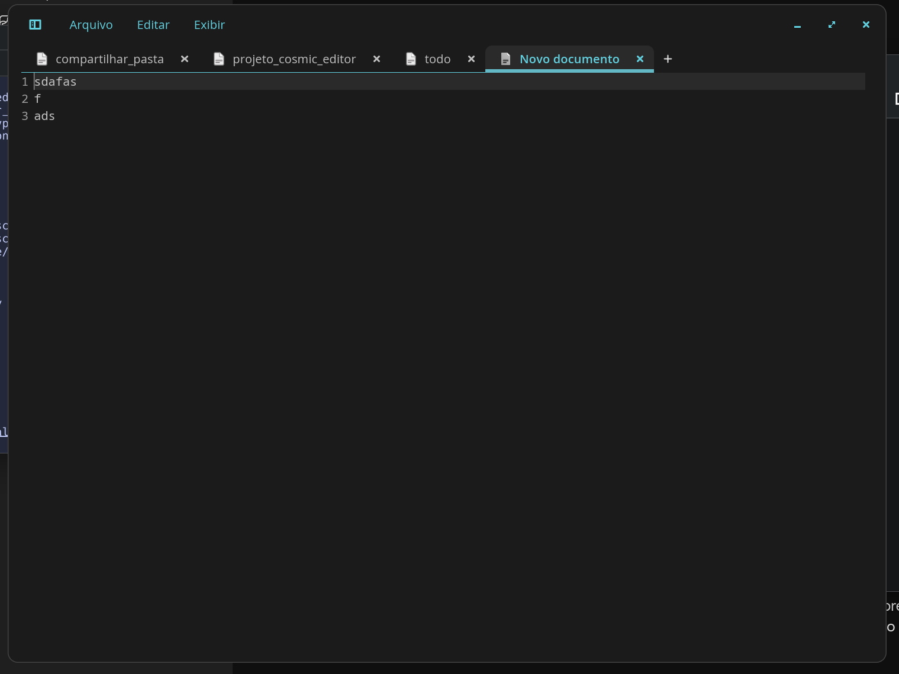

# Cosmic Edit (fork)

Sessões habilitadas no cosmic edit



Este é um fork do [cosmic-edit](https://github.com/pop-os/cosmic-edit) com melhorias focadas em produtividade e experiência de usuário.

## Implementações Realizadas:

### 1. Persistência de Sessão Completa
*   **Salvamento Automático**: O editor agora salva automaticamente o estado de todas as abas e projetos abertos ao ser fechado.
*   **Restauração de Arquivos Não Salvos**: Implementação de um sistema de backup em `~/.cache/cosmic-edit/backups/`. Se você fechar o editor com alterações pendentes, elas serão restauradas exatamente como estavam na próxima vez que abrir.
*   **Restauração de Projetos**: Os diretórios abertos na barra lateral são preservados.
*   **Aba Ativa**: O foco retorna para a mesma aba que estava sendo editada por último.

### 2. Suporte a Drag and Drop (Arrastar e Soltar) no Wayland
*   **Abertura Instantânea**: Agora é possível arrastar arquivos e pastas do gerenciador de arquivos diretamente para a janela do editor.
*   **Suporte Nativo COSMIC/Wayland**: Implementado usando `dnd_destination` com suporte a `text/uri-list` e decodificação de URIs, garantindo compatibilidade com caminhos contendo espaços e caracteres especiais (como "Área de Trabalho").

### 3. Scripts de Utilidade
Localizados na pasta `scripts/`:
*   `kill.sh`: Finaliza instâncias do editor de forma segura.
*   `run.sh`: Executa o projeto (`cargo run`) com limpeza de processos antigos.
*   `build.sh`: Compila o projeto (`cargo build`) de forma limpa.

### 4. Integração com o Sistema
*   **Atalho Desktop**: Criado o arquivo `cosmic-edit.desktop` e integrado ao menu do sistema (`~/.local/share/applications/`).
*   **Filtros de Log**: O terminal agora exibe logs limpos, ocultando erros irrelevantes de DBus/WGPU e focando nas ações do usuário.
*   **Limpeza de Código**: Removidos avisos de compilação (dead code) e variáveis não utilizadas.

### 5. Substituição do Editor do Sistema
Foi criado um script de instalação (`scripts/install_system_links.sh`) que permite usar esta versão modificada como o editor padrão do seu perfil de usuário:
*   **Override de Binário**: Cria um link em `~/.local/bin/cosmic-edit` para que o comando no terminal abra esta versão.
*   **Override de Menu**: Substitui o atalho original do COSMIC no menu de aplicativos para lançar esta versão com todas as melhorias.

## Como Executar
```bash
# Para integrar com o seu sistema (fazer uma vez):
./scripts/install_system_links.sh

# Via terminal
cosmic-edit

# Ou via menu do sistema procurando pelo ícone oficial do Cosmic Edit
```

---
Modificações realizadas via Gemini CLI em colaboração com o usuário surfx.
